# How channels get built

This explains what each script actually does and why, at the level a
regular user needs to predict what channels they'll end up with. It doesn't
cover internal API details — read the scripts themselves for that.

## Prerequisites (do this once, in Tunarr's own web UI)

None of this toolkit works until Tunarr itself knows about your Jellyfin
library. This is all done in Tunarr's own web UI (`http://<host>:8000/web`)
— none of it touches this toolkit yet. Screenshots below are from a real
walkthrough on a fresh Tunarr instance.

1. First run lands on the welcome/setup wizard:

   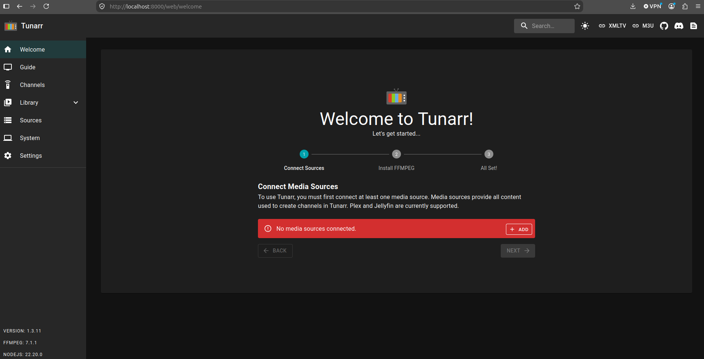

2. **Connect Sources → Add** → choose your media server (Jellyfin, Plex, or
   Emby):

   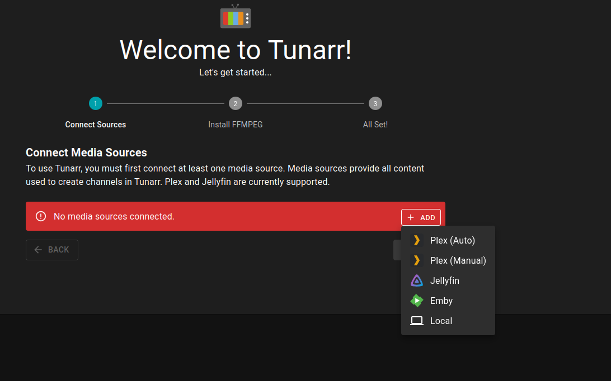

   Enter your server's URL and either a username/password (Tunarr exchanges
   it for a session token and doesn't store the password) or an API key:

   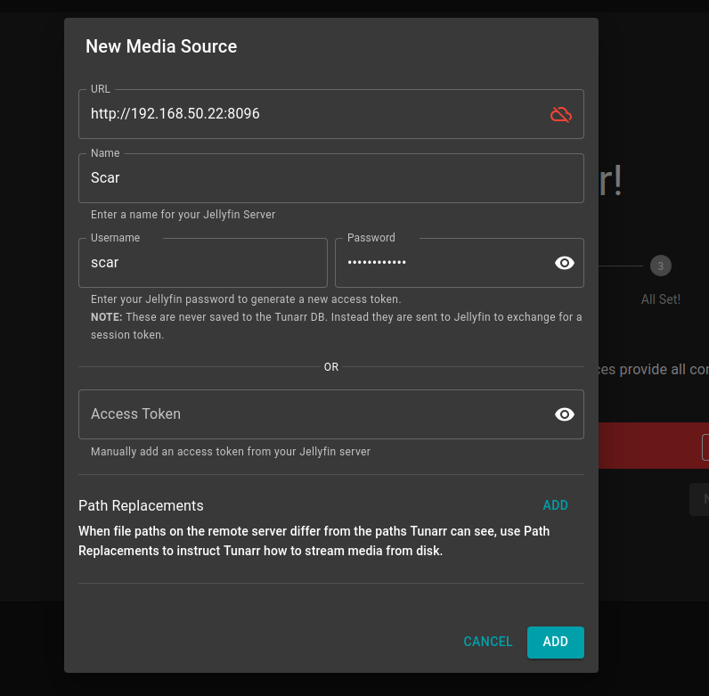

   This is the *only* place Jellyfin credentials are ever entered — nothing
   in this toolkit ever asks for them, see README.md's Auth section for why.

3. Once connected, the source shows up and you can move on:

   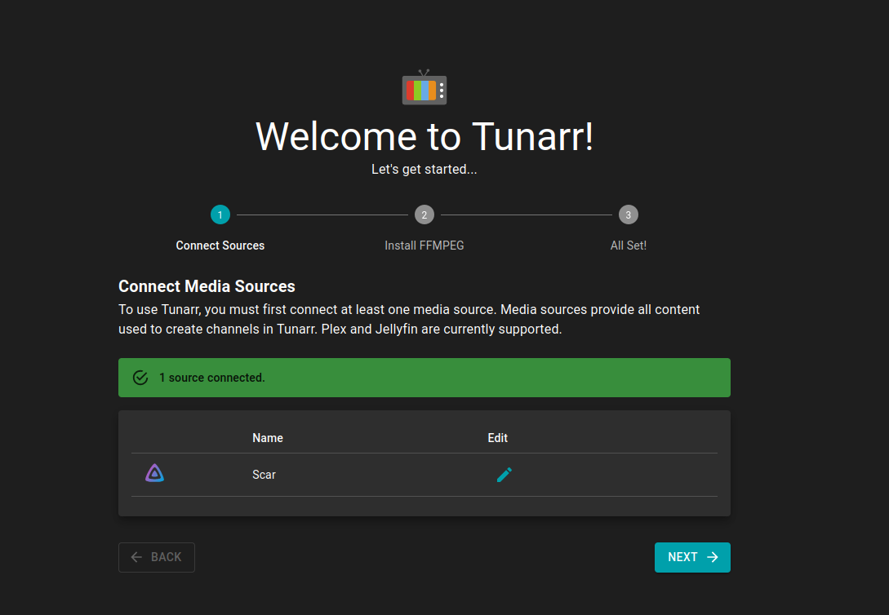

4. Tunarr checks for FFmpeg (bundled or on `PATH`) — required for
   transcoding:

   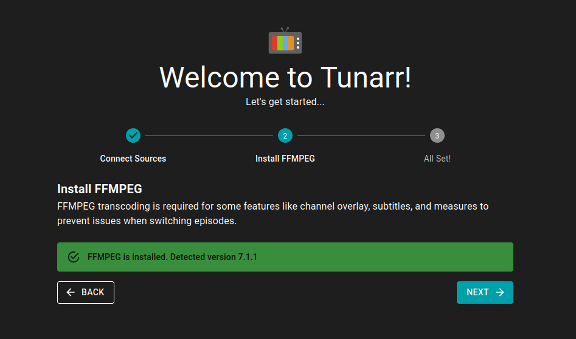

5. Wizard complete:

   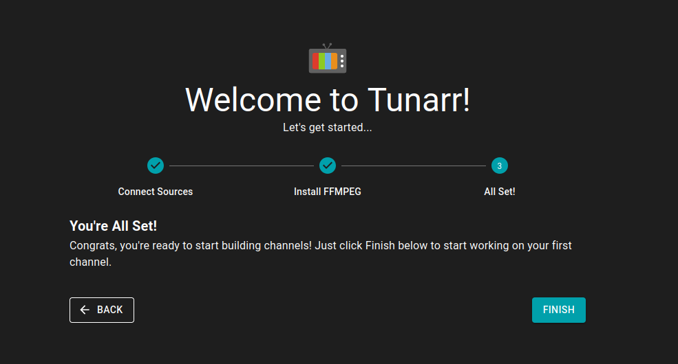

6. **Now enable the actual libraries** you want channels built from —
   Settings → Sources shows your connected source(s):

   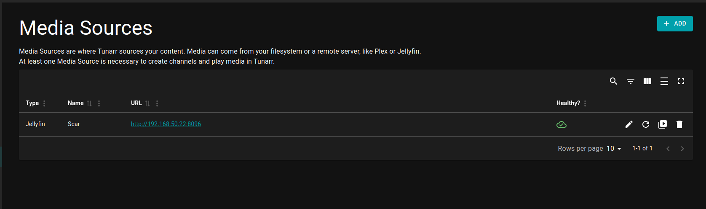

   → Edit Libraries. Enabling a library triggers a scan automatically:

   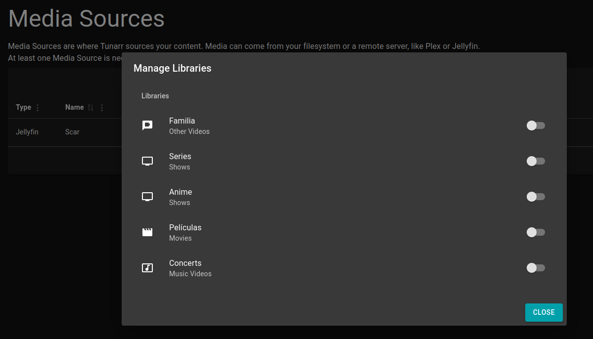

   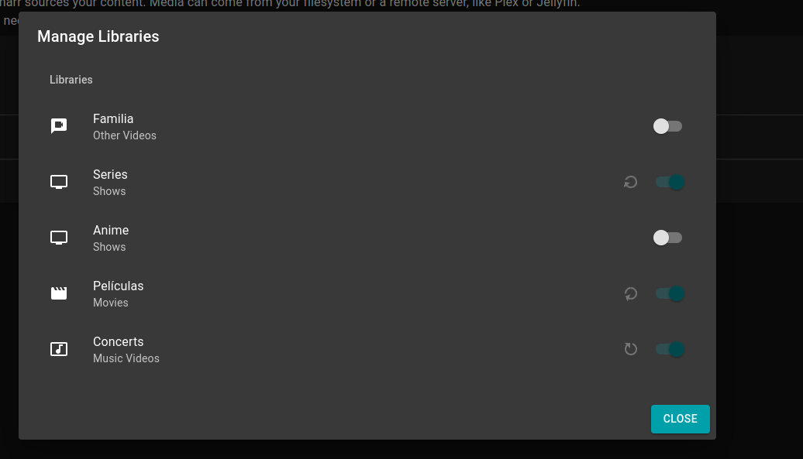

7. Under Library, watch the scan progress:

   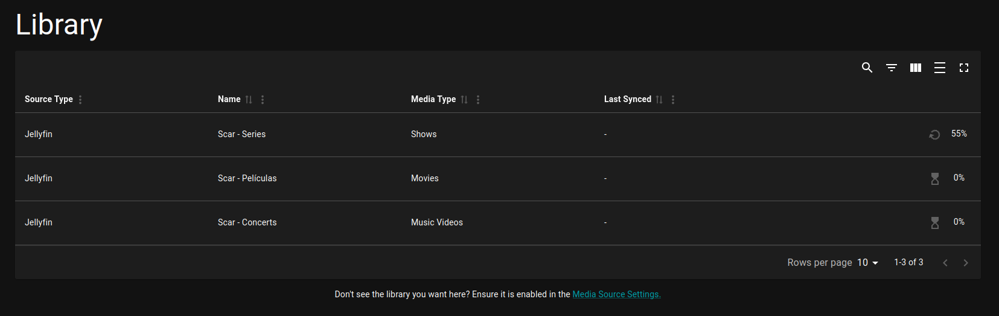

   ...until it's done:

   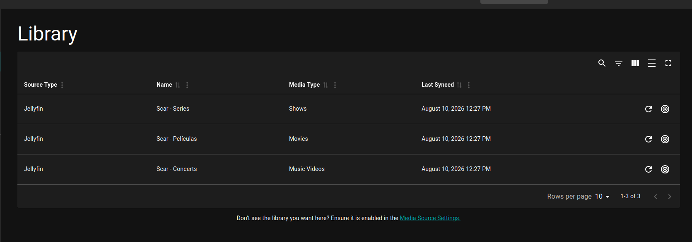

   You can trigger a rescan on demand later too — see `tunarr_status.py
   sources` and `tunarr_status.py rescan`, which surface the same scan
   Tunarr runs automatically every 6 hours by default.

8. Worth a look while you're in Settings → FFMPEG: this is also where you'd
   confirm/create the transcode config these scripts reference by name
   (`--transcode-config`, default `Default`):

   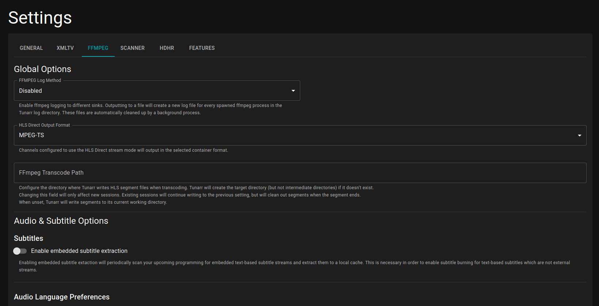

   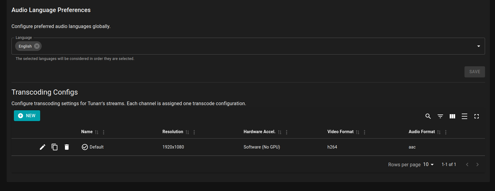

   A fresh Tunarr install only ships one, named `Default` — that's why the
   scripts default to it. If you rename it or add another, pass
   `--transcode-config <name>` to any `create_*` script.

Nothing in this toolkit needs your Jellyfin credentials — see README.md's
Auth section for why.

**Before running anything else**, `dump_library.py --library <name>` is
worth running first — a read-only table of every title, its genre(s),
runtime, and exactly where it would land (which genre channel(s), its own
per-show channel, or which mix channel), using the same placement logic the
`create_*` scripts actually run. It also flags duplicate show titles up
front. Keep using it after channels exist too, as a quick "what genre is
this on" / "where's this show" reference.

## Movie genre channels (`create_movie_channels.py`)

Every movie's Jellyfin genre tags are matched against `channel_genres.txt`
(copy from `channel_genres.txt.example` and edit for your library's actual
genres), a priority-ordered list — a movie can land on up to **2** channels
(the first 2 matches in file order), and any genre not listed in the file
is simply not auto-channeled. File order also determines channel numbering:
each line gets its own reserved block of 10 numbers starting at 200 (so the
1st line is #200-209, 2nd is #210-219, and so on) — don't reorder existing
lines once you've created channels from them, or the numbers will shift
under content that's already there.

A channel that grows past **50 movies or 72 hours of total runtime**
(whichever comes first) spills into a numbered overflow channel
(`Action`, `Action-2`, `Action-3`, ...) rather than becoming one enormous
channel.

## Per-show channels (`create_series_channels.py`)

A show's **combined runtime across every season** (not per-season) decides
whether it gets its own dedicated channel: **19 hours or more** and it does;
below that, `backfill` skips it here and routes it to a genre mix channel
instead (see below) rather than giving a 3-episode miniseries its own
one-off channel.

Each season becomes one schedule slot (episodes play in original air order,
picking up where a previous viewing left off rather than repeating from the
start — Tunarr calls this `linkMode: continue`), and all of a show's season
slots are grouped so the whole show plays through season-to-season as one
continuous watch-through, not each season resetting independently.

`create` builds one specific, named show's channel — use this when you know
exactly which show you mean. `backfill` builds channels for every
channel-worthy show in a library in one pass — the "kickstart my whole
library" command.

### Duplicate show entries

**This is real, not theoretical** — validated against an actual library
while building this toolkit, where "Avatar: The Last Airbender" and
"Futurama" each showed up as two entirely separate shows in Tunarr's index
(almost always caused by stale/orphaned Jellyfin database records, though
occasionally a genuinely different dub or cut with the same title).
`backfill` doesn't try to guess which entry is "correct" — it creates a
numbered channel for **each** one it finds (`Futurama`, `Futurama-2`, ...)
rather than dropping either, since this toolkit exists to get your whole
library onto channels in one pass, not to make editorial decisions about
your metadata for you. If you know two entries really are the same show and
want just one channel, clean that up in Jellyfin first and rerun — or use
`create --series` to build exactly one deliberately.

**Do not use Jellyfin's "Merge Versions" feature on a show/movie where the
merged entries actually differ by version, audio track, or similar** — this
has been observed to crash both this toolkit and Tunarr itself. If you have
multiple versions of the same title, keep them as separate, unmerged items.

## Small-series mix channels (`create_mix_channels.py`)

Shows below the 19h threshold are grouped into genre-based
`tv-<Genre>-mix` channels instead of getting their own channel — same
`channel_genres.txt` file as movies, but **top-1** genre match only (a
show goes on one mix channel, not up to two like movies).

**Worth knowing**: TV show genre tagging is often much sparser than movie
genre tagging — confirmed directly against a real library where movies
carried genres normally but almost every TV show (including well-known
ones) had an empty genre list. Shows with no genre match at all go to a
catch-all `tv-mix-other` channel rather than being silently dropped, but
don't be surprised if that catch-all ends up with most of your small shows
— it's a limitation of your source library's metadata, not a bug in this
script. If you want better mix-channel genre coverage, tag your shows'
genres more completely in Jellyfin first.

## What it looks like once it's run

A real `create_movie_channels.py` run against a real library, showing the
overflow behavior in action — `Action` filled up past the 50-movie/72-hour
ceiling and spilled into `Action-2` and `Action-3`, same for `Sci-Fi` and
`Comedy`:

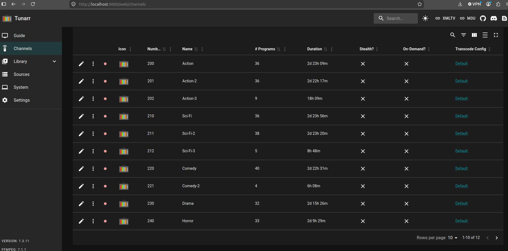

And the resulting live guide — real scheduled programming, each channel
playing through its lineup:

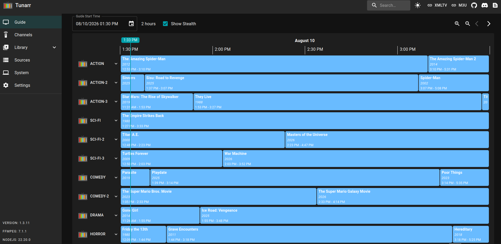

## What's deliberately out of scope

This is a kickstart, not the full personal automation toolkit it was
extracted from. Not included: validation/drift reports, structured
logging, cron scheduling, encoding-policy scripts, `.nfo`-file scanning.
